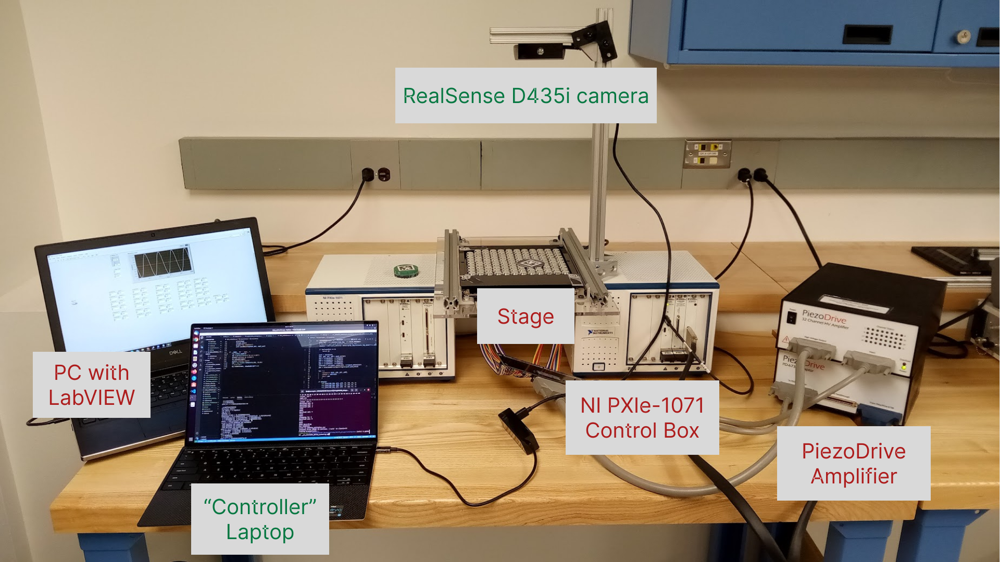
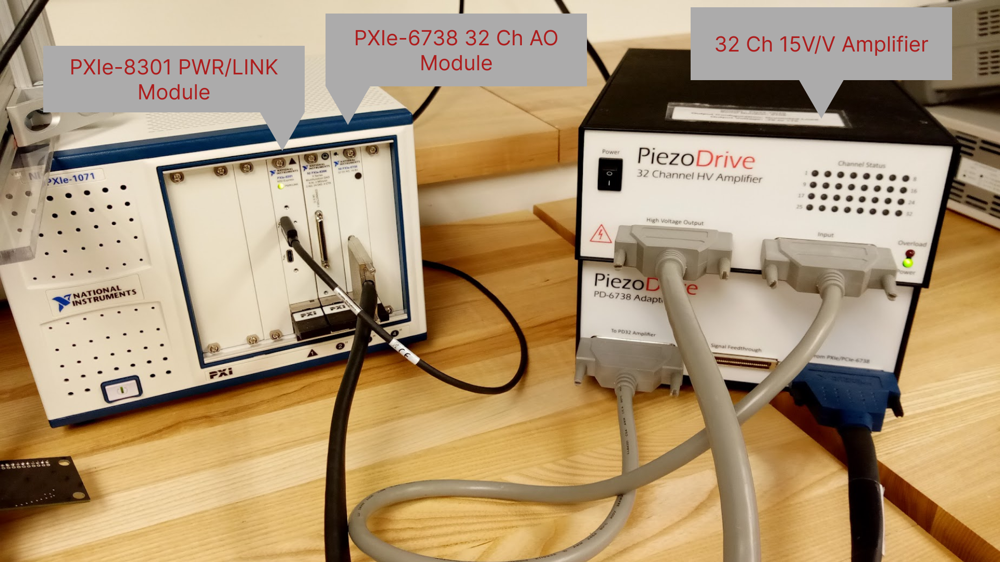
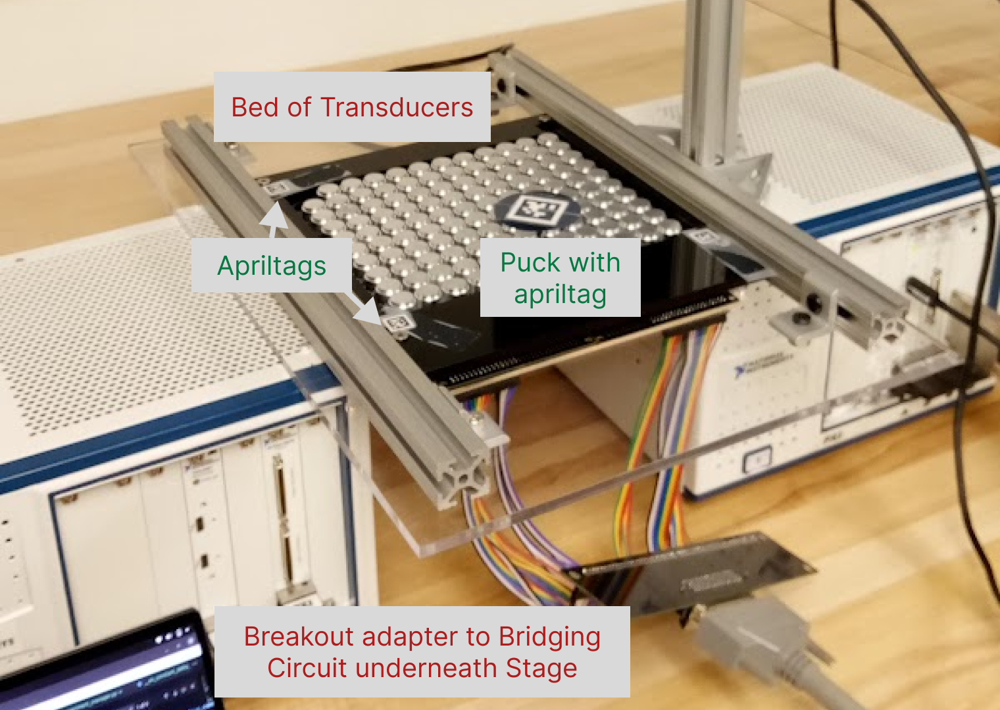

# Airbending - Phased Array Near-Field Acoustic Levitation

[](http://www.youtube.com/watch?v=7jeP6OGwBek "[Stitch]")
[Click to Play Video]

This project seeks to levitate and drive silicon wafers by controlling the phase shift patterns applied to a gridded matrix of ultrasonic acoustic sensors. 


It begins minimally with the design and fabrication of a bed of transducers coupled with the hardware of a vision system mounted to a single stage.
Hardware in hand, the project will continue through a data collection and then a learning phase, then ultimately should culminate into a collection of elemental phase shift patterns that map to elemental control signals to drive silicon wafers around.


A fully-fledged completed system would be well suited for contact-less transport or positioning of silicon wafers (and other sensitive materials), in a manufacturing context for example.


The video above demonstrates the current data-collection process of applying guesses at possibly useful phase shift patterns and recording the response for later analysis.


## Hardware Setup



The hardware is organized as two halves – a “device”-side and a “controller”-side, with wireless communication between them.

### The “device”
The “device” refers to the components that together provide signals specified by phase and amplitudes to each of the acoustic transducer units.

- The bed of transducers embedded in the stage
- Windows PC, with LabVIEW installed and authorized
- A combo of National Instruments’ 32 Channel 16-bit Analog Output module (PXIe-6738) and Thunderbolt 3 PXI Remote Control Module (PXIe-8301)  
- Piezo Drive Amplifier to amplifier the 32 analog signals by 15x (up to 140Vpp max)

### The “controller”
The “controller” refers to parts of the setup responsible for the vision and the central command for specifying and executing the data-collection and learning experiments and eventually resolving and following trajectories.

- Realsense D431i mounted overhead
- Fiducial markers embedded on the stage for targeting the region of interest
- The “puck” 
- - alternating between a ~50mm diameter silicon wafer and a 1.75” diameter acrylic disc during experiments 
- - with a fiducial marker centered on top face - for detection and tracking





### [Optional] Automated Centering Attachment [-not-pictured]
This optional attachment has two sections that slide together to engage with and center the acrylic puck on the bed of transducers.
It is complete with 
- two assemblies of stepper-motor w/ lead screws, one mounted to each sliding section
- two mount plates fixing the lead screw nut in place
- and a PIC32 microcontroller-based control circuit


## Configuration Instructions
### Wireless Comms
1. Connect both device-side and controller side computers to the same subnet on the same local network. Internet access may be required for LabVIEW authentication. Note the device-side computer’s ip address. This will need to be specified on the controller-side launch to enable communication.

2. Disable Firewall on the Windows PC, or reconfigure firewall settings to allow incoming and outgoing TCP/IP connections to the controller computer.

### “Device”
1. Connect the NI PXIe-6738 (32 Channel Analog Output) module through the PiezoDrive 32 Channel HV Amplifier to the breakout adapter underneath the stage

2. Connect the Windows PC to the PXIe-8310 (PWR/LINK) module of the control box

3. Launch the `Test1.vi` virtual instrument to verify the LabVIEW to NI equipment connection.Might have to rename the module’s reference name via the NI MAX application. Error messages will alert so, if necessary
- `C:\Users\Ping Guo\Documents\onedrive_backup\OneDrive - Northwestern University\Desktop\KojoWelbeck\ProjectEnvironment\NI VIs\Test1.vi`

### “Controller”
1. Connect the Realsense camera to the controller laptop by USB

2. Place the Puck on the bed of transducers

3. Launch the RealsenseViewer or run the `Python/data_collection.py` module’s script to verify the camera's connection. The script requires that the puck be in place.

### [Optional] Data Collection Centering Attachment
1. The microcontroller-based control circuit must be connected by USB to the controller-side laptop. The PORT variable of the Makefile must match the port assigned to this USB connection. Edit the makefile, recompile and write to the PIC32 (make then make write from within the `NU32/Stepper_Control directory`), if necessary.


## Data Collection Runtime Instructions

### “Device”
1. Open up the Test1.vi virtual instrument in LabVIEW
2. Run the VI to verify the LabVIEW-to-NI-equipment connection (Repeated from the Configuration Instructions)
3. Change the following control values in the VI display:
```
Frequency: 40000 or 40k
Fs: 400000 or 400k
#s: 100000
singal: 0
```

4. Activate the virtual environment, if necessary
5. Navigate to the repository’s Python subdirectory
6. Run the actuate_server.py script

### “Controller”
1. Activate virtual environment, if necessary
2. Navigate to the 
3. Run any of the experiment definition scripts (prefixed with “__ex_”) with command-line arguments
- eg `python3 __ex__repeat_control.py --run-duration 5`
4. Follow script prompts to cycle through different control inputs

[Videos of Run]


## Directory Breakout/Organization
- `Arduino` - Testing Microcontroller control loops on arduino
- `Cpp` - Prototyping and testing code for serial communication with PIC32, and for converting phase shift patterns into microcontroller commands. These were relevant to the original intent of designing and building circuitry to control the array of transducers, prior to the decision of pivoting to NI Modules
- `Jupyter` - Playground for formulating various algorithms incorporated into the final package of python modules. (eg. vision processing and  reverse multiplexing)
- `NU32` - Low Level PIC32 control software/firmware for stepper-motor control, for controlling 120 transducers, and some interrupt and serial communication tests along the way.  
- `Python` - Collection of scripts and modules run or called on either side of the device-controller divide
